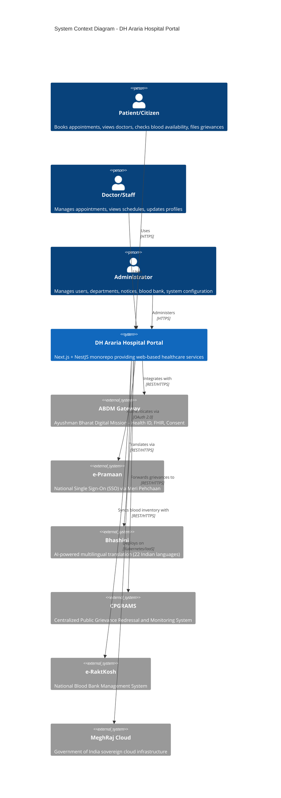
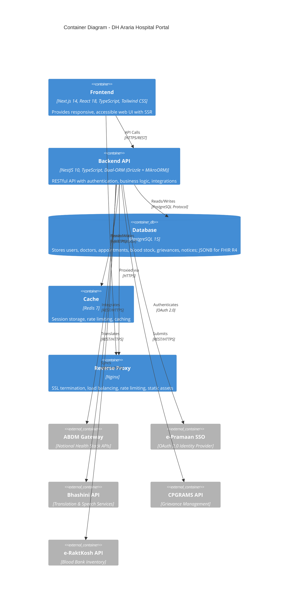
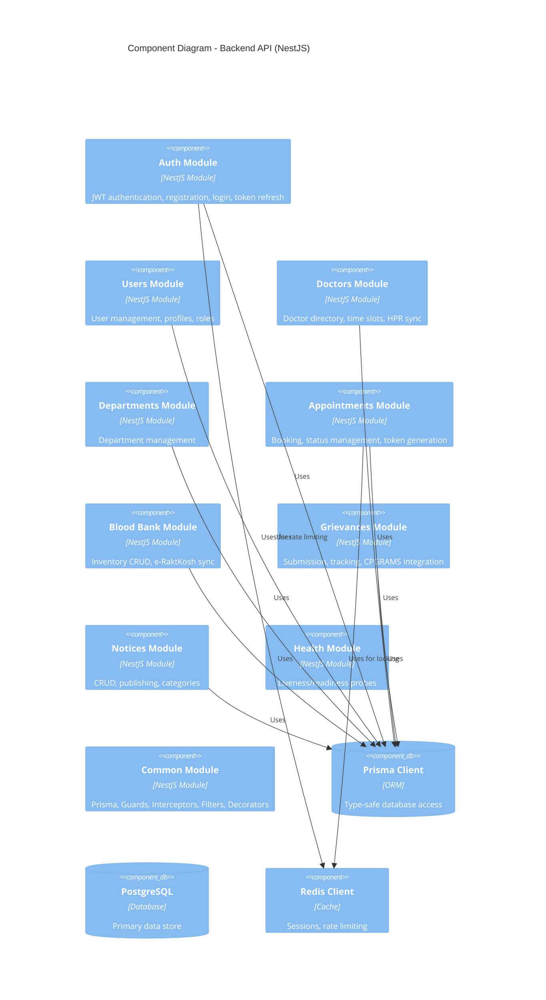

# DH Araria Hospital Portal - Architecture Documentation

## Overview

This document describes the architecture of the District Hospital Araria Digital Healthcare Portal, a modern, accessible, and scalable digital healthcare platform built following Government of India standards.

## System Context



## Container Diagram



## Component Diagram - Backend



## Database and ORM Architecture

### Primary Database: PostgreSQL 15+

We use PostgreSQL as our single database engine for the entire project. For standard relational data (users, roles, basic appointments), we use standard tables. For the deeply nested, unstructured FHIR R4 medical records mandated by the Ayushman Bharat Digital Mission (ABDM), we utilize PostgreSQL's native `JSONB` columns instead of introducing a separate NoSQL database. This keeps the cloud infrastructure simple and reduces long-term maintenance.

#### JSONB for FHIR R4 Bundles

The `FhirBundle` entity uses a `JSONB` column to store complete FHIR R4 bundles:

```typescript
// Prisma Schema Example
model FhirBundle {
  id              String   @id @default(cuid())
  bundleId        String   @unique
  resourceType    String   @default("Bundle")
  bundleType      String
  patientId       String
  careContextId   String?
  fhirJson        Json     // JSONB column for full FHIR R4 bundle
  encryptedData   String?
  encryptionKey   String?
  status          String   @default("PENDING")
  createdAt       DateTime @default(now())
  updatedAt       DateTime @updatedAt

  @@index([bundleId])
  @@index([patientId])
  @@index([careContextId])
  @@index([status])
  @@map("fhir_bundles")
}
```

This approach provides:
- **Schema Flexibility**: FHIR R4 resources have complex, variable structures that map naturally to JSONB
- **Query Performance**: PostgreSQL's GIN indexes on JSONB enable fast querying of FHIR elements
- **ACID Compliance**: Full transactional support for health data operations
- **Simplified Infrastructure**: No separate MongoDB/NoSQL cluster needed

### Dual-ORM Strategy (Data Access Layer)

We implement two different Object-Relational Mappers based on the specific needs of our service domains:

| ORM | Use Case | Rationale |
|-----|----------|-----------|
| **Drizzle ORM** | Citizen-Facing Services | Lightweight, "SQL-first", zero abstraction overhead, extreme performance for high-traffic public endpoints |
| **MikroORM** | Clinical & ABDM Services | Strict "Unit of Work" architecture, atomic transactions for health data, lifecycle hooks for CERT-In audit logs |

#### Drizzle ORM (Citizen-Facing Services)

**Used for**: Homepage, basic appointment booking, grievance routing, doctor directory, blood bank inventory, notices

```typescript
// apps/backend/src/common/drizzle/drizzle.module.ts
import { Module, Global } from '@nestjs/common';
import { drizzle } from 'drizzle-orm/node-postgres';
import { Pool } from 'pg';
import * as schema from './schema';

@Global()
@Module({
  providers: [
    {
      provide: 'DRIZZLE',
      useFactory: () => {
        const pool = new Pool({
          connectionString: process.env.DATABASE_URL,
        });
        return drizzle(pool, { schema });
      },
    },
  ],
  exports: ['DRIZZLE'],
})
export class DrizzleModule {}
```

```typescript
// Usage in Citizen-Facing Services (e.g., Appointments)
import { Inject, Injectable } from '@nestjs/common';
import { eq, and, gte, lte } from 'drizzle-orm';
import { appointments, doctors, timeSlots } from '../common/drizzle/schema';

@Injectable()
export class PublicAppointmentService {
  constructor(@Inject('DRIZZLE') private db: DrizzleDb) {}

  async findAvailableSlots(doctorId: string, date: Date) {
    const dayOfWeek = date.getDay();
    return this.db
      .select()
      .from(timeSlots)
      .where(
        and(
          eq(timeSlots.doctorId, doctorId),
          eq(timeSlots.dayOfWeek, dayOfWeek),
          eq(timeSlots.isAvailable, true)
        )
      );
  }
}
```

**Key Benefits**:
- **Zero Abstraction Overhead**: Near-raw SQL performance
- **Type-Safe SQL**: Full TypeScript inference
- **Lightweight**: ~10KB bundle size
- **Connection Pooling**: Native pg pool integration

#### MikroORM (Clinical & ABDM Services)

**Used for**: ABDM M2 (HIP - FHIR bundle generation), ABDM M3 (HIU - Consent management), Clinical records, FHIR bundle encryption/decryption

```typescript
// apps/backend/src/common/mikro/mikro.module.ts
import { Module, Global } from '@nestjs/common';
import { MikroORM } from '@mikro-orm/postgresql';
import { EntityGenerator } from '@mikro-orm/entity-generator';

@Global()
@Module({
  providers: [
    {
      provide: 'MIKRO_ORM',
      useFactory: async () => {
        return await MikroORM.init({
          entities: ['dist/**/*.entity.js'],
          entitiesTs: ['src/**/*.entity.ts'],
          dbName: process.env.DB_NAME,
          host: process.env.DB_HOST,
          port: parseInt(process.env.DB_PORT || '5432'),
          user: process.env.DB_USERNAME,
          password: process.env.DB_PASSWORD,
          debug: process.env.NODE_ENV === 'development',
          extensions: [EntityGenerator],
        });
      },
    },
  ],
  exports: ['MIKRO_ORM'],
})
export class MikroModule {}
```

```typescript
// Clinical Entity with Lifecycle Hooks for CERT-In Audit Logging
// apps/backend/src/modules/abdm/entities/fhir-bundle.entity.ts
import { Entity, Property, PrimaryKey, Index, EntityRepositoryType, OnInit, OnCreate, OnUpdate, OnDelete } from '@mikro-orm/core';
import { Repository } from '@mikro-orm/core';
import { AuditLogService } from '../../common/audit/audit-log.service';

@Entity({ tableName: 'fhir_bundles' })
export class FhirBundle {
  @PrimaryKey()
  id: string;

  @Property({ unique: true })
  bundleId: string;

  @Property()
  resourceType: string = 'Bundle';

  @Property()
  bundleType: string;

  @Property()
  patientId: string;

  @Property({ nullable: true })
  careContextId?: string;

  @Property({ type: 'jsonb' })
  fhirJson: any;

  @Property({ nullable: true })
  encryptedData?: string;

  @Property({ nullable: true })
  encryptionKey?: string;

  @Property({ default: 'PENDING' })
  status: string;

  @Property()
  createdAt: Date = new Date();

  @Property({ onUpdate: () => new Date() })
  updatedAt: Date = new Date();

  @Index()
  patientIdIdx: string;

  @Index()
  careContextIdIdx: string;

  @Index()
  statusIdx: string;

  // MikroORM Lifecycle Hooks for CERT-In Audit Compliance
  @OnCreate()
  async onCreate(em: EntityManager) {
    await AuditLogService.log({
      action: 'FHIR_BUNDLE_CREATE',
      resource: 'FhirBundle',
      resourceId: this.id,
      details: { bundleId: this.bundleId, patientId: this.patientId },
    });
  }

  @OnUpdate()
  async onUpdate(em: EntityManager) {
    await AuditLogService.log({
      action: 'FHIR_BUNDLE_UPDATE',
      resource: 'FhirBundle',
      resourceId: this.id,
      details: { bundleId: this.bundleId, status: this.status },
    });
  }

  @OnDelete()
  async onDelete(em: EntityManager) {
    await AuditLogService.log({
      action: 'FHIR_BUNDLE_DELETE',
      resource: 'FhirBundle',
      resourceId: this.id,
      details: { bundleId: this.bundleId },
    });
  }

  [EntityRepositoryType]?: EntityRepository<FhirBundle>;
}
```

**Key Benefits**:
- **Unit of Work**: Guarantees atomic transactions for complex health data operations
- **Identity Map**: Prevents duplicate entities in memory
- **Lifecycle Hooks**: Automatic CERT-In audit logging on create/update/delete
- **Change Tracking**: Only modified fields are persisted
- **Transaction Boundaries**: Explicit transaction control for ABDM flows

### ORM Selection Guide for Developers

| Module / Service | ORM to Use | Reason |
|------------------|------------|--------|
| Homepage / Landing Page | Drizzle | High traffic, simple queries |
| Doctor Directory | Drizzle | Read-heavy, public access |
| Basic Appointment Booking | Drizzle | High concurrency, simple CRUD |
| Grievance Submission | Drizzle | Public-facing, moderate traffic |
| Blood Bank Inventory | Drizzle | Real-time polling, simple reads |
| Notices / Announcements | Drizzle | Read-heavy, public |
| **ABDM M2 (HIP)** | **MikroORM** | **FHIR bundles, Fidelius encryption, atomic transactions** |
| **ABDM M3 (HIU)** | **MikroORM** | **Consent management, audit trails** |
| **Clinical Records** | **MikroORM** | **Complex transactions, audit logging** |
| **FHIR Bundle Encryption** | **MikroORM** | **ECDH + AES-GCM, lifecycle hooks** |

### Shared Database Connection

Both ORMs connect to the same PostgreSQL instance but use different connection pools:

```typescript
// docker-compose.yml (shared postgres)
services:
  postgres:
    image: postgres:15-alpine
    environment:
      POSTGRES_DB: dh_araria
      POSTGRES_USER: ${DB_USER}
      POSTGRES_PASSWORD: ${DB_PASSWORD}
    volumes:
      - postgres_data:/var/lib/postgresql/data
    ports:
      - "5432:5432"
    command: >
      postgres
      -c max_connections=200
      -c shared_buffers=256MB
      -c effective_cache_size=1GB
      -c maintenance_work_mem=64MB
      -c checkpoint_completion_target=0.9
      -c wal_buffers=16MB
      -c default_statistics_target=100
      -c random_page_cost=1.1
      -c effective_io_concurrency=200
```

---

## Data Model (ER Diagram)

```mermaid
erDiagram
    USER ||--o{ APPOINTMENT : "patient"
    USER ||--o{ APPOINTMENT : "doctor"
    USER ||--o{ GRIEVANCE : "files"
    USER ||--o{ NOTICE : "authors"
    DOCTOR ||--o{ APPOINTMENT : "has"
    DOCTOR }|--|| USER : "extends"
    DOCTOR }|--|| DEPARTMENT : "belongs to"
    DEPARTMENT ||--o{ DOCTOR : "has"
    DEPARTMENT ||--o{ APPOINTMENT : "has"
    DOCTOR ||--o{ TIME_SLOT : "has"
    BLOOD_STOCK }|--|| BLOOD_GROUP : "typed"
    BLOOD_STOCK }|--|| COMPONENT_TYPE : "typed"
    GRIEVANCE }|--|| USER : "assigned to"
    NOTICE }|--|| USER : "authored"
    
    USER {
        string id PK
        string email UK
        string password
        string name
        string phone UK
        enum role
        boolean isActive
        string abhaId UK
        datetime createdAt
        datetime updatedAt
    }
    
    DOCTOR {
        string id PK
        string userId FK UK
        string name
        string specialization
        string qualification
        int experience
        string hprId UK
        string departmentId FK
        float consultationFee
        string[] languages
        string bio
        string imageUrl
        boolean isActive
    }
    
    DEPARTMENT {
        string id PK
        string name UK
        string description
        string icon
        string imageUrl
        boolean isActive
    }
    
    APPOINTMENT {
        string id PK
        string patientId FK
        string doctorId FK
        string departmentId FK
        datetime appointmentDate
        string startTime
        string endTime
        enum status
        enum type
        string reason
        string notes
        string abhaId
        int tokenNumber
    }
    
    BLOOD_STOCK {
        string id PK
        enum bloodGroup
        enum componentType
        int unitsAvailable
        datetime lastUpdated
    }
    
    GRIEVANCE {
        string id PK
        string userId FK
        string name
        string email
        string phone
        enum category
        string subject
        string description
        enum status
        string cpgramsId UK
        string assignedTo FK
        string resolution
    }
    
    NOTICE {
        string id PK
        string title
        string content
        enum category
        enum priority
        datetime publishedAt
        datetime expiresAt
        boolean isPublished
        string attachmentUrl
        string language
        string authorId FK
    }
```

## Deployment Architecture

```mermaid
C4Deployment
    title Deployment Diagram - MeghRaj Cloud Production
    
    Node(meghraj, "MeghRaj National Cloud", "Government of India Sovereign Cloud") {
        Node(ndc1, "NDC Delhi (Primary)", "Tier-III Data Center") {
            Container(k8s1, "Kubernetes Cluster", "K8s 1.28+")
            Container(pg1, "PostgreSQL Primary", "Patroni HA Cluster")
            Container(redis1, "Redis Primary", "Sentinel HA")
        }
        Node(ndc2, "NDC Pune (DR)", "Tier-III Data Center") {
            Container(k8s2, "Kubernetes Cluster", "K8s 1.28+")
            Container(pg2, "PostgreSQL Replica", "Streaming Replication")
            Container(redis2, "Redis Replica", "Sentinel HA")
        }
        Node(lb, "Global Load Balancer", "Citrix/F5") {
            Component(waf, "WAF", "Web Application Firewall")
            Component(ddos, "Anti-DDoS", "DDoS Protection")
        }
    }
    
    Node(ext, "External Systems") {
        Component(abdm, "ABDM Gateway")
        Component(epramaan, "e-Pramaan SSO")
        Component(bhashini, "Bhashini API")
        Component(cpgrams, "CPGRAMS")
        Component(eraktkosh, "e-RaktKosh")
    }
    
    Rel(lb, k8s1, "Routes to")
    Rel(lb, k8s2, "Failover to")
    Rel(k8s1, pg1, "Reads/Writes")
    Rel(k8s2, pg2, "Reads/Writes")
    Rel(pg1, pg2, "Replicates")
    Rel(k8s1, redis1, "Reads/Writes")
    Rel(k8s2, redis2, "Reads/Writes")
    Rel(redis1, redis2, "Replicates")
    
    Rel(k8s1, ext, "Integrates with")
    Rel(k8s2, ext, "Integrates with")
```

## Security Architecture

### Defense in Depth

1. **Network Layer**
   - MeghRaj perimeter firewall
   - WAF with OWASP CRS rules
   - Anti-DDoS protection
   - Network segmentation (DMZ, App, DB tiers)

2. **Transport Layer**
   - TLS 1.3 everywhere
   - HSTS with preload
   - Certificate pinning for external APIs

3. **Application Layer**
   - Helmet.js security headers
   - CORS policy (whitelist only)
   - Rate limiting (100 req/min general, 10 req/min auth)
   - Input validation (Zod/class-validator)
   - SQL injection prevention (Prisma ORM)
   - XSS prevention (React auto-escaping)

4. **Data Layer**
   - Encryption at rest (AES-256)
   - Encryption in transit (TLS 1.3)
   - PII/PHI field-level encryption
   - Database audit logging

5. **Identity & Access**
   - JWT with RS256 signing
   - Short-lived access tokens (15 min)
   - Refresh token rotation
   - Role-based access control (RBAC)
   - e-Pramaan SSO integration (Phase 3)

### CERT-In Compliance

- 180-day log retention (ELK stack)
- 6-hour incident reporting capability
- NTP synchronization (time.nic.in, time.nplindia.org)
- Vulnerability management (monthly scans)
- Secure configuration baselines

## Accessibility Architecture

### WCAG 2.2 AA / GIGW 3.0 Compliance

1. **Perceivable**
   - Semantic HTML5 structure
   - Text alternatives for all non-text content
   - 4.5:1 contrast ratio (3:1 for large text)
   - Responsive text up to 200% zoom
   - No content loss at 320px width

2. **Operable**
   - Full keyboard navigation
   - Focus indicators (2px solid, 3:1 contrast)
   - No keyboard traps
   - Skip to main content link
   - No seizure-inducing content

3. **Understandable**
   - Consistent navigation
   - Clear form labels and instructions
   - Error identification and suggestions
   - Language declaration (lang attribute)

4. **Robust**
   - Valid HTML5
   - ARIA roles/attributes where needed
   - Compatible with NVDA, JAWS
   - Graceful degradation

### Implementation Stack
- **Radix UI Primitives** - Accessible component foundations
- **Tailwind CSS** - Utility-first with accessibility utilities
- **axe-core** - Automated testing in CI
- **Manual testing** - NVDA/JAWS + keyboard-only

## Integration Architecture

### Phase 1: MVP (Current)
- Standalone PostgreSQL database
- Internal JWT authentication
- Local file storage
- Mock external integrations

### Phase 2: Compliance Hardening
- ELK Stack for centralized logging
- NTP synchronization
- Content Management Policy (CMAP)
- Content Archival Policy (CAP)
- Security audit preparation

### Phase 3: DPI Integrations

| Integration | Protocol | Purpose | Status |
|-------------|----------|---------|--------|
| **Bhashini** | REST/HTTPS | 22-language translation, ASR/TTS | Planned |
| **e-Pramaan** | OAuth 2.0 | Citizen SSO via Meri Pehchaan | Planned |
| **CPGRAMS** | REST/HTTPS | Grievance forwarding & tracking | Planned |
| **e-RaktKosh** | REST/HTTPS | Real-time blood inventory sync | Planned |
| **ABDM M1** | REST/HTTPS | ABHA creation, verification | Planned |
| **ABDM M2** | FHIR R4 + Fidelius | HIP - Generate encrypted health records | Planned |
| **ABDM M3** | FHIR R4 + Fidelius | HIU - Request/consume health records | Planned |

### ABDM Technical Details

```
ABDM Integration Flow (M2 - HIP):
1. PHR App requests records via ABDM Gateway
2. Gateway sends webhook to /api/abdm/on-discover
3. Backend acknowledges with HTTP 202
4. Backend discovers matching care contexts
5. Backend encrypts FHIR Bundle via Fidelius (ECDH + AES-GCM)
6. Backend pushes to ABDM Gateway callback URL
7. Gateway delivers to requesting PHR App

FHIR Bundle Requirements:
- Profile: ABDM FHIR R4
- Terminology: SNOMED CT, LOINC, ICD-10
- Encryption: Fidelius (ECDH P-256 + AES-256-GCM)
- Consent: Time-bound with auto-expiry
```

## Performance Requirements

| Metric | Target | Measurement |
|--------|--------|-------------|
| **Page Load (FCP)** | < 1.5s | Lighthouse/Real User Monitoring |
| **Page Load (LCP)** | < 2.5s | Lighthouse/Real User Monitoring |
| **API Response (p95)** | < 500ms | APM/Load Testing |
| **API Response (p99)** | < 1s | APM/Load Testing |
| **Availability** | 99.9% | Uptime Monitoring |
| **Concurrent Users** | 10,000+ | Load Testing |
| **Database Connections** | Pool of 100 | Connection Pool Monitoring |

## Monitoring & Observability

### Metrics (Prometheus/Grafana)
- HTTP request rate, latency, errors
- Database query performance
- Cache hit ratios
- Queue depths
- Business metrics (appointments, grievances)

### Logging (ELK Stack)
- Structured JSON logging (Pino)
- 180-day retention
- Correlation IDs for request tracing
- Audit logs for sensitive operations

### Tracing (Jaeger/OpenTelemetry)
- Distributed tracing across services
- External API call tracking
- Database query spans

### Alerting
- PagerDuty/Slack/Email notifications
- SLA-based alerting
- Runbook-linked alerts

## Disaster Recovery

### RPO/RTO Targets
- **RPO**: 5 minutes (PostgreSQL streaming replication)
- **RTO**: 30 minutes (Active-Active Kubernetes)

### Backup Strategy
- **Continuous**: WAL archiving to object storage
- **Daily**: Logical backups (pg_dump) at 02:00 IST
- **Weekly**: Full cluster backup verification
- **Monthly**: DR failover test

### Failover Process
1. Health check detects primary NDC failure
2. Global LB redirects traffic to DR NDC
3. PostgreSQL replica promoted to primary
4. Redis sentinel promotes replica
5. Kubernetes pods rescheduled
6. DNS/Load balancer update (automated)

## Development Standards

### Code Quality Gates
- TypeScript strict mode
- ESLint (no errors, warnings allowed)
- Prettier formatting
- 80% unit test coverage
- 100% critical path coverage
- axe-core accessibility tests in CI

### Git Workflow
- Trunk-based development
- Feature flags for incomplete work
- Conventional commits
- PR reviews required
- Automated CI checks

### Release Process
- Semantic versioning
- Automated changelog
- Staging deployment
- Production deployment with rollback
- Post-deployment smoke tests

---

*Document Version: 1.0*  
*Last Updated: 2024-10-06*  
*Classification: Internal - Government Use*